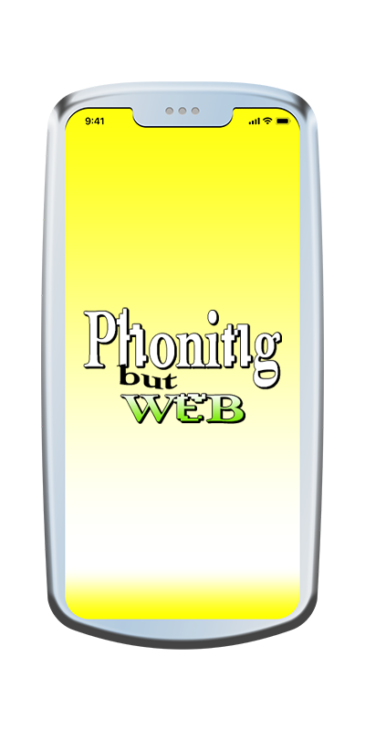
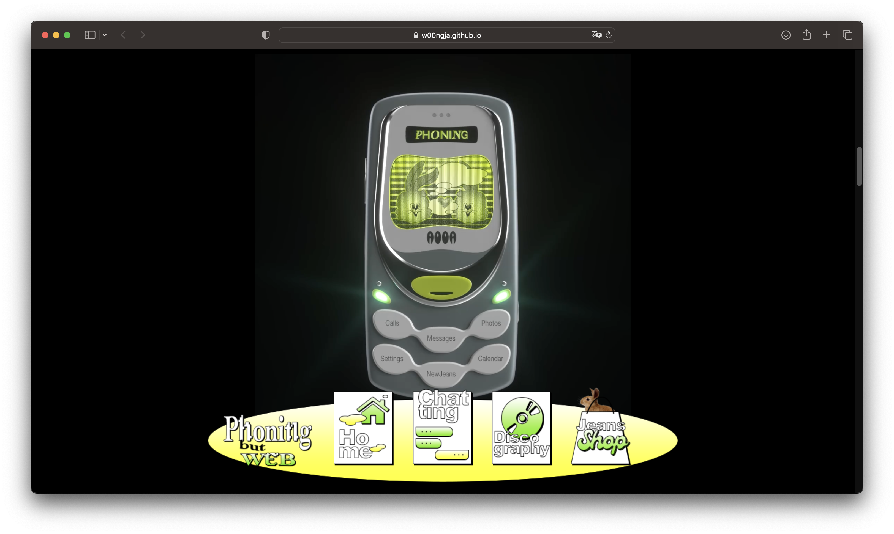
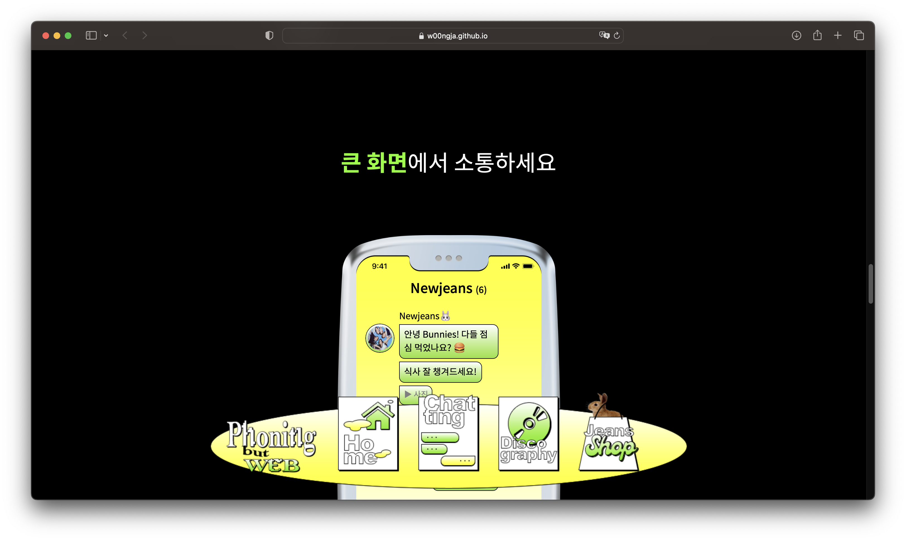
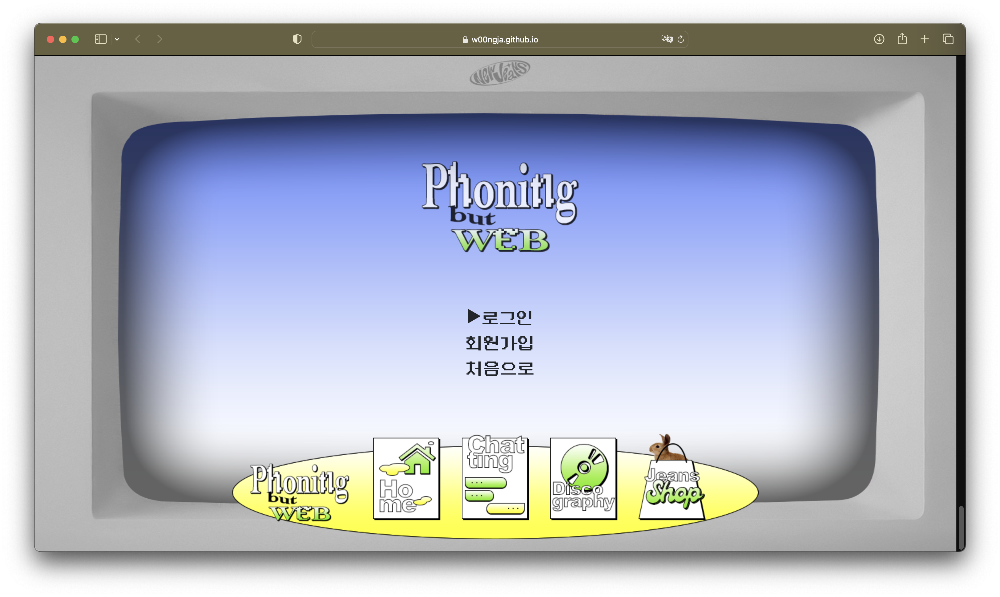
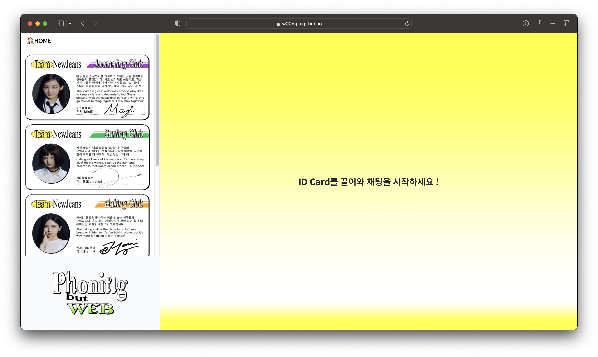
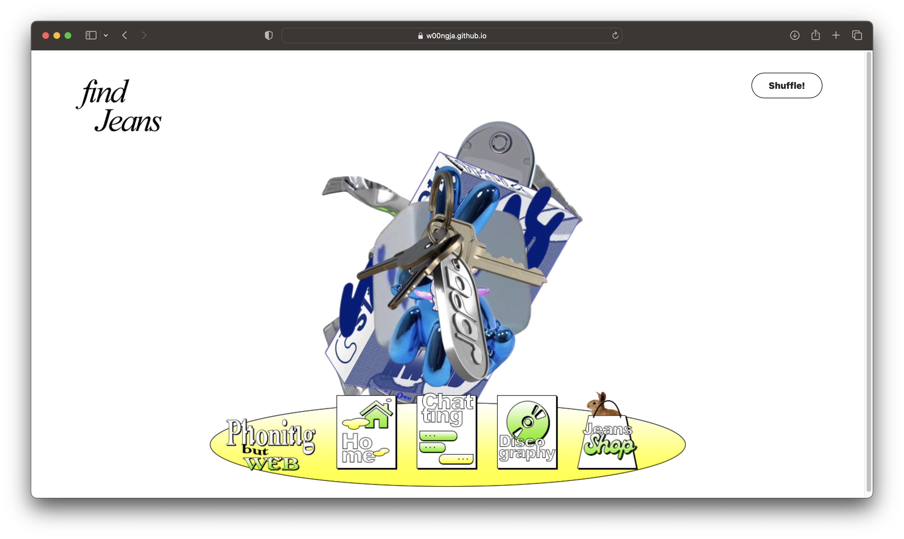

# Phoning but WEB
 

   
  
   

## 프로젝트 소개

뉴진스와 팬들을 위한 모바일 소통 플랫폼 ‘포닝’의 웹 버젼 Phoning but WEB.
 이젠 큰 화면에서 즐기세요 ! 

1. 제작한 프로젝트를 직접 확인해보세요 
https://w00ngja.github.io/Phoning-but-WEB/

2. 블로그에 방문하여 프로젝트의 디테일을 살펴보세요 
https://w00ngja.tistory.com/46 

2. 노션에 방문하여 프로젝트 제작 과정을 살펴보세요 
https://wzarchive.notion.site/Phoning-but-web-e174d4fdf8664ddcbf847318e34ded23

 

## 기술 스택

|     CSS     |    HTML   |  JS   |
| :--------:  | :--------: | :------: |
|   ![css]    |   ![html]   | ![js] |

 

## Overview

### 1. Main page

브랜드 '뉴진스' 랜딩페이지. 
스크롤 제어를 통한 비디오 프레임 조정, Transform 등의 유저 인터렉션 구현.

   
  
   
  
   
  
   
  
   
  
   
  
   

 

### 2. Chatting Room

드래그앤드롭과 LocalStorage를 활용하여 구현한 채팅창

   
  
   

 

### 3. Discography

랜덤 Transition을 활용한 Item Shuffling

   
  
   
  
   
  
  
   

 

## 배운 점 & 아쉬운 점

1. Cleancode 
프로젝트를 진행하며 약 4개 정도의 페이지를 짰는데, 페이지마다 코드를 짜는 법을 달리 해보았다. 일부러 그런 것은 아니고 페이지를 거듭할수록 개선점이 보여 발전하는 느낌으로.. 실제 코드를 보면 초반부 작업한 Index 페이지와 후반부 작업한 Discography 부분의 차이가 확연한 것을 알 수 있다. 프로젝트의 규모가 그리 크지 않고 바닐라 JS로만 작업했음에도 깔끔한 코드의 필요성을 알 수 있었고, 추후에 리액트까지 익히고 나면 그 중요함이 배가될 것이니 미리 인지할 수 있어 좋았던 것 같다.

2. Use API 
멜론이나 스포티파이 같은 음원 플랫폼에서 제공하는 API와 연동해볼 생각이었지만, 마땅히 알맞은 것도 없었기에 본 프로젝트엔 활용하지 못했다. 

3. Browser Optimization 
사파리를 기반으로 코드를 테스트하며 진행해서 그런지, 당장 크롬에서만 열어도 쫌 페이지가 깨지는 것을 볼 수 있었다. 모바일은 말할 것도 없이 .. 프로젝트 진행 간 특정 브라우저에서만 적용되는 -webkit- 이나 메서드들도 살펴볼 수 있었는데, 초기 설계 단계부터 해당 문제들을 고려할 필요가 있다는 생각을 했다.

 

<!-- Stack Icon Refernces -->

[js]: /readmeSrc/javascript.svg
[css]: /readmeSrc/css.svg
[html]: /readmeSrc/html.svg
